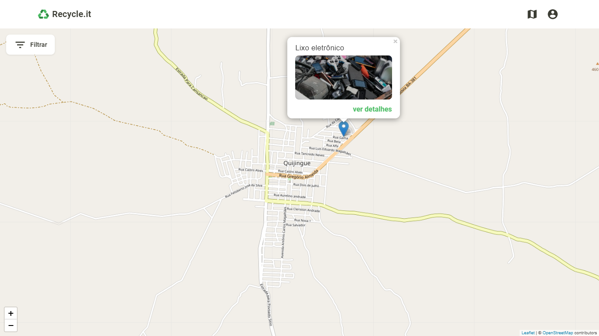
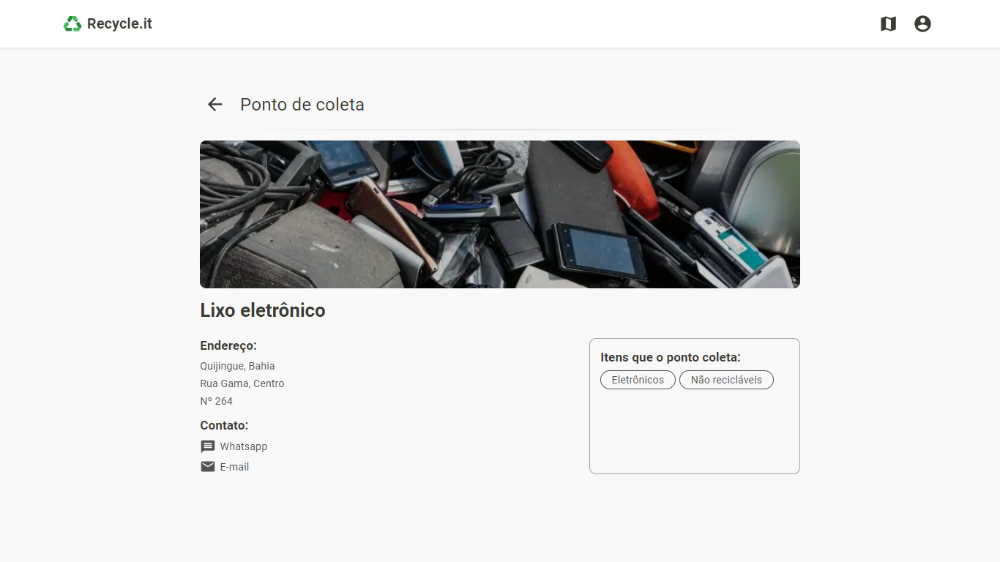

<div align="center">
  
</div>

# Recycle.it

Aplicação de geolocalização de pontos de coleta de resíduos.

## 🖼️ Imagens do projeto

*Imagens ilustrativas, não demonstram a versão completa do projeto.*

<div align="center">
  
                                                                       
  
</div>


## 🧪 Tecnologias utilizadas
- [TypeScript](https://www.typescriptlang.org/)
- [Node.JS](https://nodejs.org/en/)
- [ReactJS](https://reactjs.org/)
- [Next.js](https://nextjs.org/)
- [Prisma](https://www.prisma.io/)

## 💻 Como iniciar

### Requisitos

- [Git](https://git-scm.com/)
- [Node.JS](https://nodejs.org/en/)
- [NPM](https://www.npmjs.com/) ou [Yarn](https://yarnpkg.com/)

> Versão do Node utilizada no projeto: 14.16.x

```bash
  # Clone o repositório
  $ git clone https://github.com/gjoao11/recycleit.git
  
  # Entre na pasta do projeto
  $ cd recycleit
```

> O Back e o Front End devem rodar simultaneamente

### Back End

```bash
  # A partir da raiz do projeto
  
  # Entre na pasta do Back End
  $ cd recycleit-api
  
  # Instale as dependências
  $ yarn
  
  # Setup do banco de dados
  $ yarn prisma migrate dev --name init
  $ yarn prisma db seed --preview-feature
  
  # Inicie a aplicação
  $ yarn dev
```

### Front End

```bash
  # A partir da raiz do projeto
  
  # Entre na pasta do Front End
  $ cd recycleit-web
  
  # Instale as dependências
  $ yarn
  
  # Inicie a aplicação
  $ yarn dev
```
